# This is whitenights

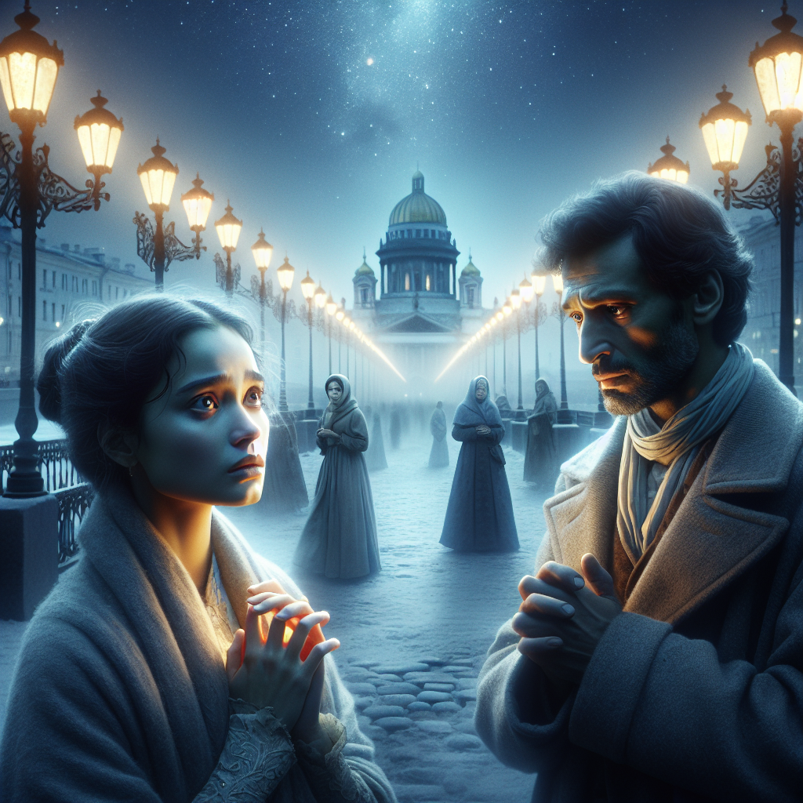

WHITE NIGHTS

a sentimental story from the diary of a dreamer

FIRST NIGHT

It was a wonderful night, such a night as is only possible when we are young, dear reader. The sky was so starry, so bright that, looking at it, one could not help asking oneself whether ill-humoured and capricious people could live under such a sky. That is a youthful question too, dear reader, very youthful, but may the Lord put it more frequently into your heart!... Speaking of capricious and ill-humoured people, I cannot help recalling my moral condition all that day. From early morning I had been oppressed by a strange despondency. It suddenly seemed to me that I was lonely, that every one was forsaking me and going away from me. Of course, any one is entitled to ask who "every one" was.

 For though I had been living almost eight years in Petersburg I had hardly an acquaintance. But what did I want with acquaintances? I was acquainted with all Petersburg as it was; that was why I felt as though they were all deserting me when all Petersburg packed up and went to its summer villa.
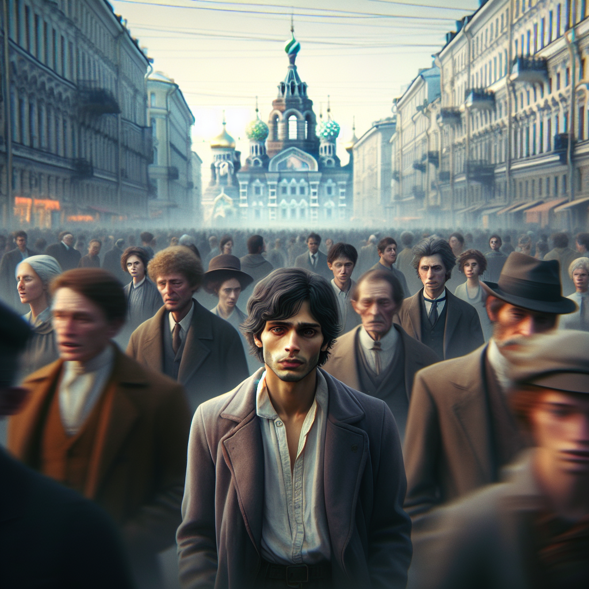

 I felt afraid of being left alone, and for three whole days I wandered about the town in profound dejection, not knowing what to do with myself. Whether I walked in the Nevsky, went to the Gardens or sauntered on the embankment, there was not one face of those I had been accustomed to meet at the same time and place all the year. They, of course, do not know me, but I know them. I know them intimately, I have almost made a study of their faces, and am delighted when they are gay, and downcast when they are under a cloud. I have almost struck up a friendship with one old man whom I meet every blessed day, at the same hour in Fontanka. Such a grave, pensive countenance; he is always whispering to himself and brandishing his left arm, while in his right hand he holds a long gnarled stick with a gold knob. He even notices me and takes a warm interest in me. If I happen not to be at a certain time in the same spot in Fontanka, I am certain he feels disappointed.

 That is how it is that we almost bow to each other, especially when we are both in good humour. The other day, when we had not seen each other for two days and met on the third, we were actually touching our hats, but, realizing in time, dropped our hands and passed each other with a look of interest.
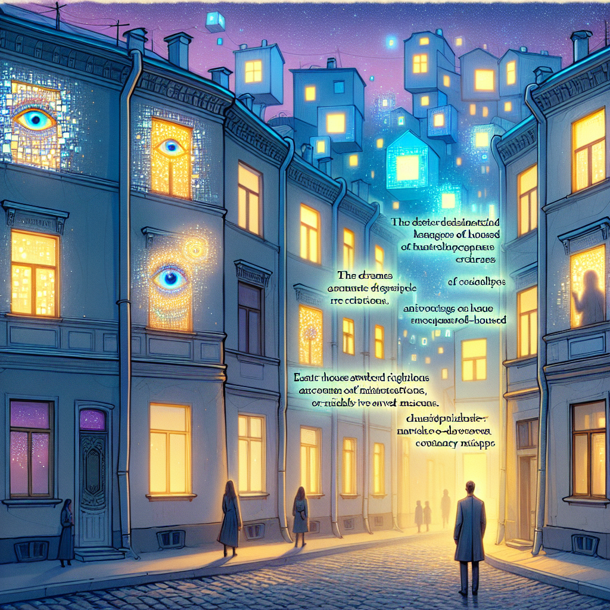

I know the houses too. As I walk along they seem to run forward in the streets to look out at me from every window, and almost to say: "Good-morning! How do you do? I am quite well, thank God, and I am to have a new storey in May," or, "How are you? I am being redecorated to-morrow;" or, "I was almost burnt down and had such a fright," and so on. I have my favourites among them, some are dear friends; one of them intends to be treated by the architect this summer. I shall go every day on purpose to see that the operation is not a failure. God forbid!
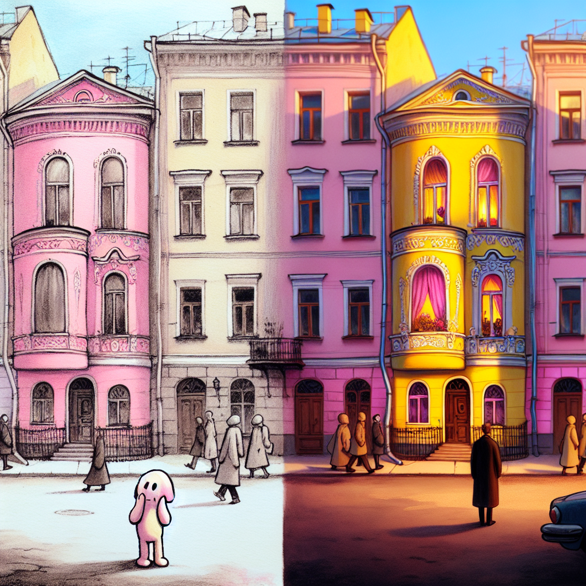

 But I shall never forget an incident with a very pretty little house of a light pink colour. It was such a charming little brick house, it looked so hospitably at me, and so proudly at its ungainly neighbours, that my heart rejoiced whenever I happened to pass it. Suddenly last week I walked along the street, and when I looked at my friend I heard a plaintive, "They are painting me yellow!" The villains! The barbarians! They had spared nothing, neither columns, nor cornices, and my poor little friend was as yellow as a canary. It almost made me bilious. And to this day I have not had the courage to visit my poor disfigured friend, painted the colour of the Celestial Empire.
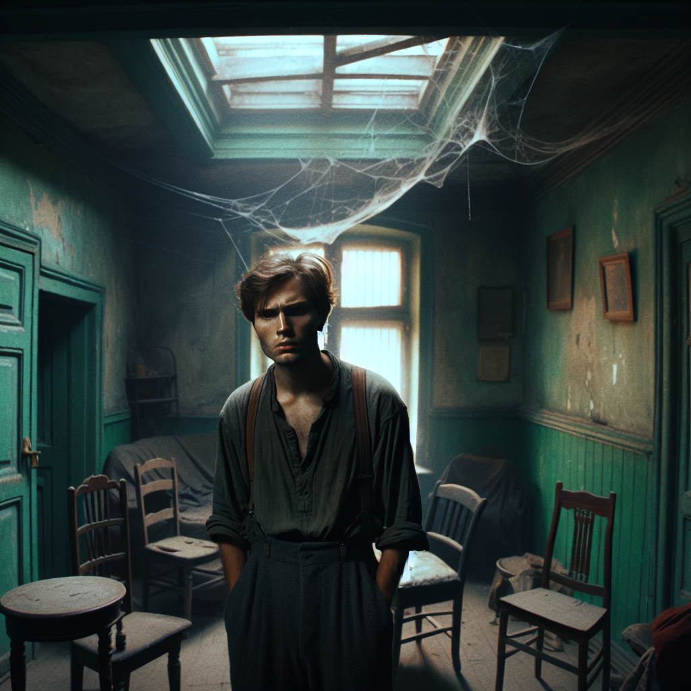

So now you understand, reader, in what sense I am acquainted with all Petersburg.

I have mentioned already that I had felt worried for three whole days before I guessed the cause of my uneasiness. And I felt ill at ease in the street—this one had gone and that one had gone, and what had become of the other?—and at home I did not feel like myself either. For two evenings I was puzzling my brains to think what was amiss in my corner; why I felt so uncomfortable in it. And in perplexity I scanned my grimy green walls, my ceiling covered with a spider's web, the growth of which Matrona has so successfully encouraged. I looked over all my furniture, examined every chair, wondering whether the trouble lay there (for if one chair is not standing in the same position as it stood the day before, I am not myself). I looked at the window, but it was all in vain ... I was not a bit the better for it!
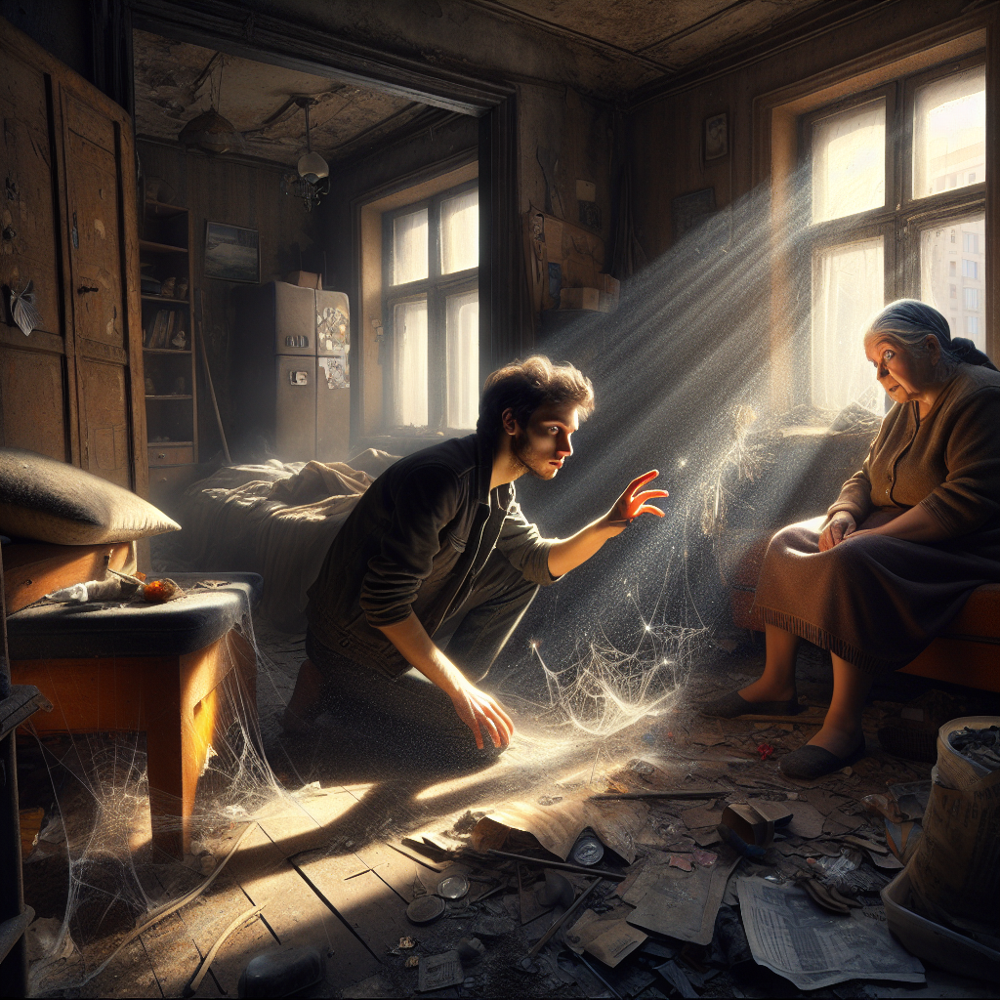

 I even bethought me to send for Matrona, and was giving her some fatherly admonitions in regard to the spider's web and sluttishness in general; but she simply stared at me in amazement and went away without saying a word, so that the spider's web is comfortably hanging in its place to this day. I only at last this morning realized what was wrong. Aie!
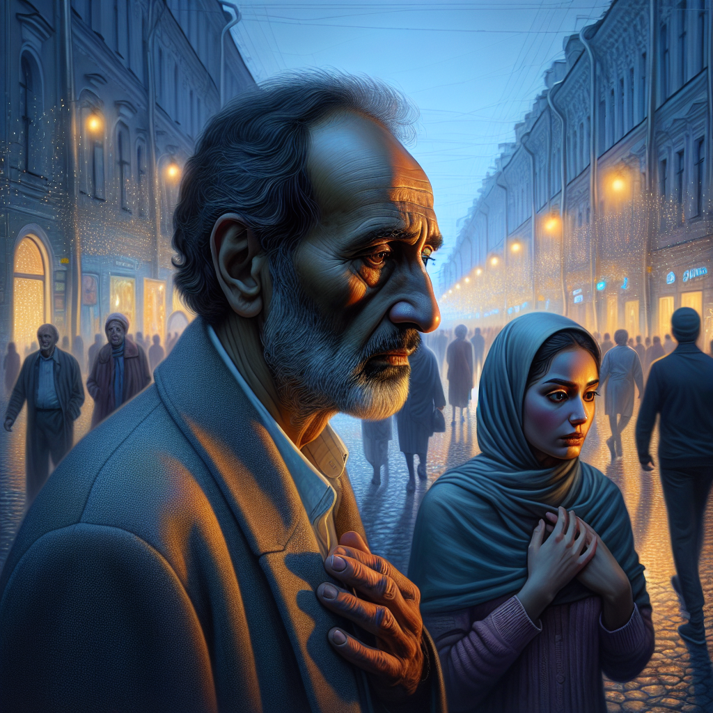

 Why, they are giving me the slip and making off to their summer villas! Forgive the triviality of the expression, but I am in no mood for fine language ... for everything that had been in Petersburg had gone or was going away for the holidays; for every respectable gentleman of dignified appearance who took a cab was at once transformed, in my eyes, into a respectable head of a household who after his daily duties were over, was making his way to the bosom of his family, to the summer villa; for all the passers-by had now quite a peculiar air which seemed to say to every one they met: "We are only here for the moment, gentlemen, and in another two hours we shall be going off to the summer villa."
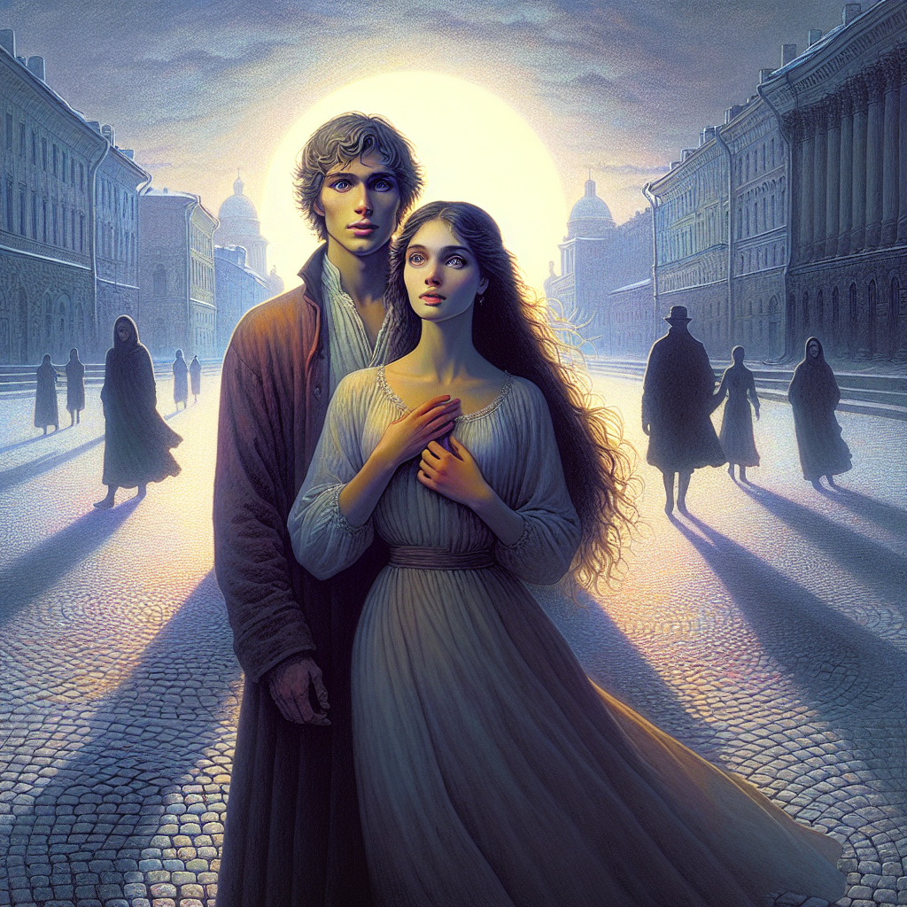

 If a window opened after delicate fingers, white as snow, had tapped upon the pane, and the head of a pretty girl was thrust out, calling to a street-seller with pots of flowers—at once on the spot I fancied that those flowers were being bought not simply in order to enjoy the flowers and the spring in stuffy town lodgings, but because they would all be very soon moving into the country and could take the flowers with them. What is more, I made such progress in my new peculiar sort of investigation that I could distinguish correctly from the mere air of each in what summer villa he was living. The inhabitants of Kamenny and Aptekarsky Islands or of the Peterhof Road were marked by the studied elegance of their manner, their fashionable summer suits, and the fine carriages in which they drove to town.
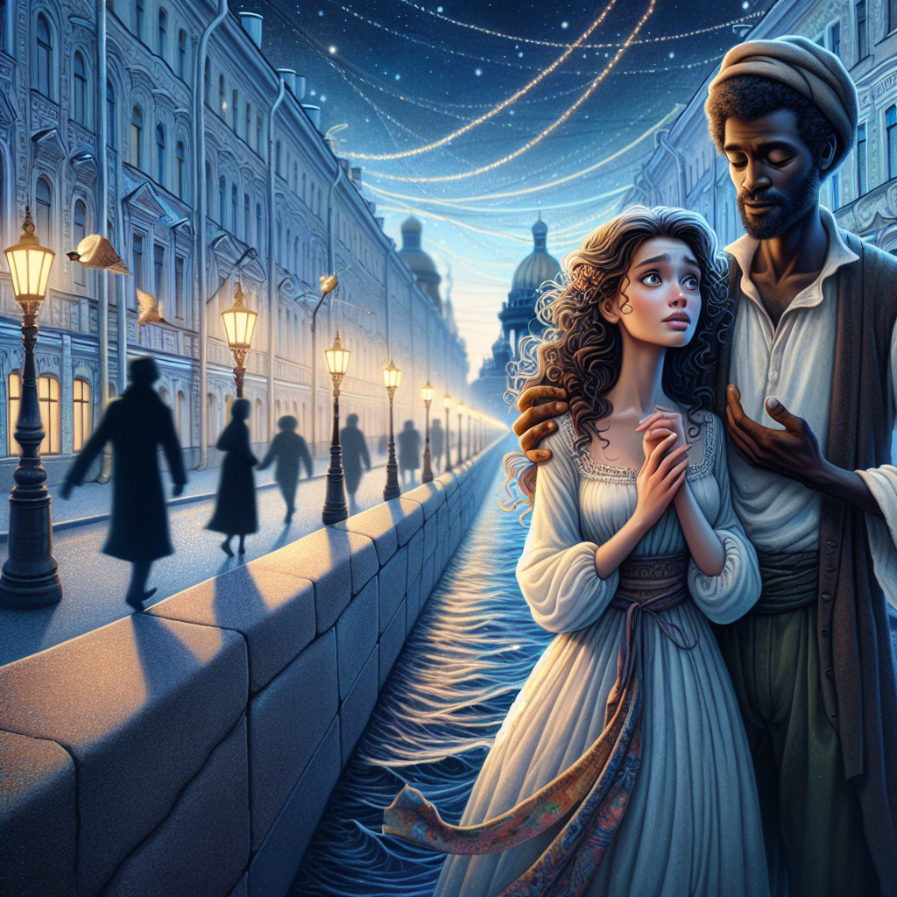

 Visitors to Pargolovo and places further away impressed one at first sight by their reasonable and dignified air; the tripper to Krestovsky Island could be recognized by his look of irrepressible gaiety. If I chanced to meet a long procession of waggoners walking lazily with the reins in their hands beside waggons loaded with regular mountains of furniture, tables, chairs, ottomans and sofas and domestic utensils of all sorts, frequently with a decrepit cook sitting on the top of it all, guarding her master's property as though it were the apple of her eye; or if I saw boats heavily loaded with household goods crawling along the Neva or Fontanka to the Black River or the Islands—the waggons and the boats were multiplied tenfold, a hundredfold, in my eyes. I fancied that everything was astir and moving, everything was going in regular caravans to the summer villas.

 It seemed as though Petersburg threatened to become a wilderness, so that at last I felt ashamed, mortified and sad that I had nowhere to go for the holidays and no reason to go away. I was ready to go away with every waggon, to drive off with every gentleman of respectable appearance who took a cab; but no one—absolutely no one—invited me; it seemed they had forgotten me, as though really I were a stranger to them!

I took long walks, succeeding, as I usually did, in quite forgetting where I was, when I suddenly found myself at the city gates. Instantly I felt lighthearted, and I passed the barrier and walked between cultivated fields and meadows, unconscious of fatigue, and feeling only all over as though a burden were falling off my soul. All the passers-by gave me such friendly looks that they seemed almost greeting me, they all seemed so pleased at something. They were all smoking cigars, every one of them. And I felt pleased as I never had before.
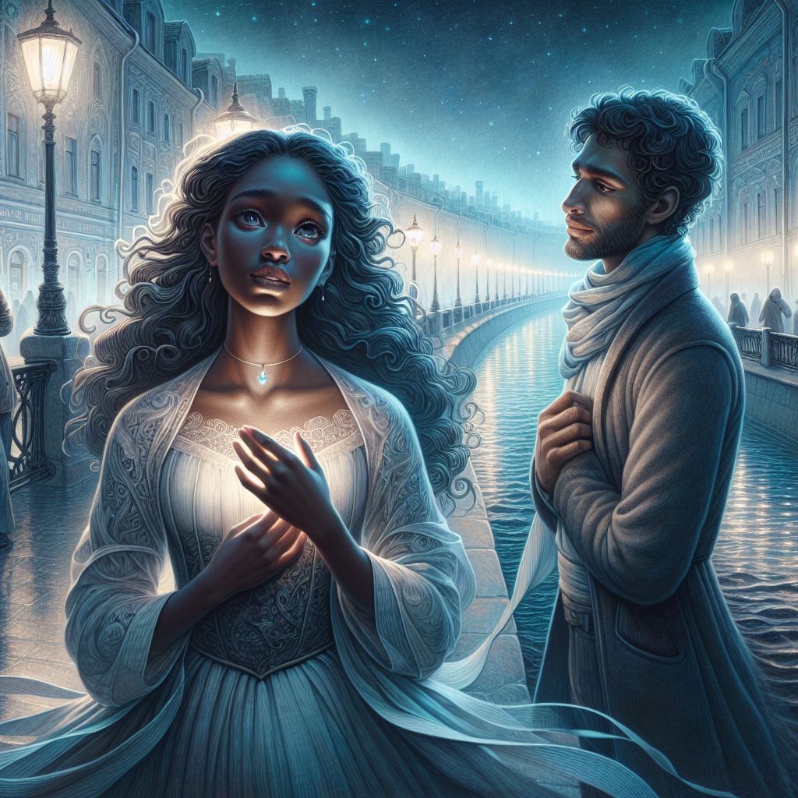

 It was as though I had suddenly found myself in Italy—so strong was the effect of nature upon a half-sick townsman like me, almost stifling between city walls.
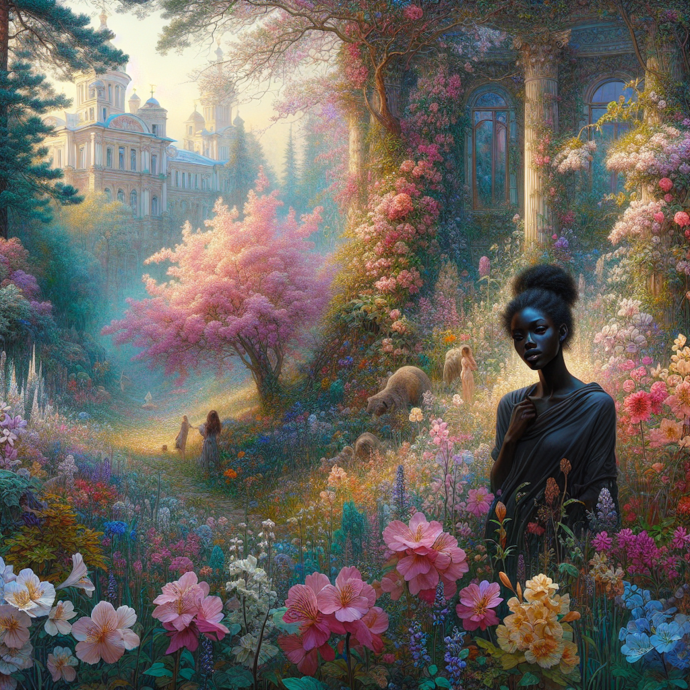

There is something inexpressibly touching in nature round Petersburg, when at the approach of spring she puts forth all her might, all the powers bestowed on her by Heaven, when she breaks into leaf, decks herself out and spangles herself with flowers.... Somehow I cannot help being reminded of a frail, consumptive girl, at whom one sometimes looks with compassion, sometimes with sympathetic love, whom sometimes one simply does not notice; though suddenly in one instant she becomes, as though by chance, inexplicably lovely and exquisite, and, impressed and intoxicated, one cannot help asking oneself what power made those sad, pensive eyes flash with such fire?

 What summoned the blood to those pale, wan cheeks? What bathed with passion those soft features? What set that bosom heaving? What so suddenly called strength, life and beauty into the poor girl's face, making it gleam with such a smile, kindle with such bright, sparkling laughter? You look round, you seek for some one, you conjecture.... But the moment passes, and next day you meet, maybe, the same pensive and preoccupied look as before, the same pale face, the same meek and timid movements, and even signs of remorse, traces of a mortal anguish and regret for the fleeting distraction.... And you grieve that the momentary beauty has faded so soon never to return, that it flashed upon you so treacherously, so vainly, grieve because you had not even time to love her....

And yet my night was better than my day! This was how it happened.

I came back to the town very late, and it had struck ten as I was going towards my lodgings.
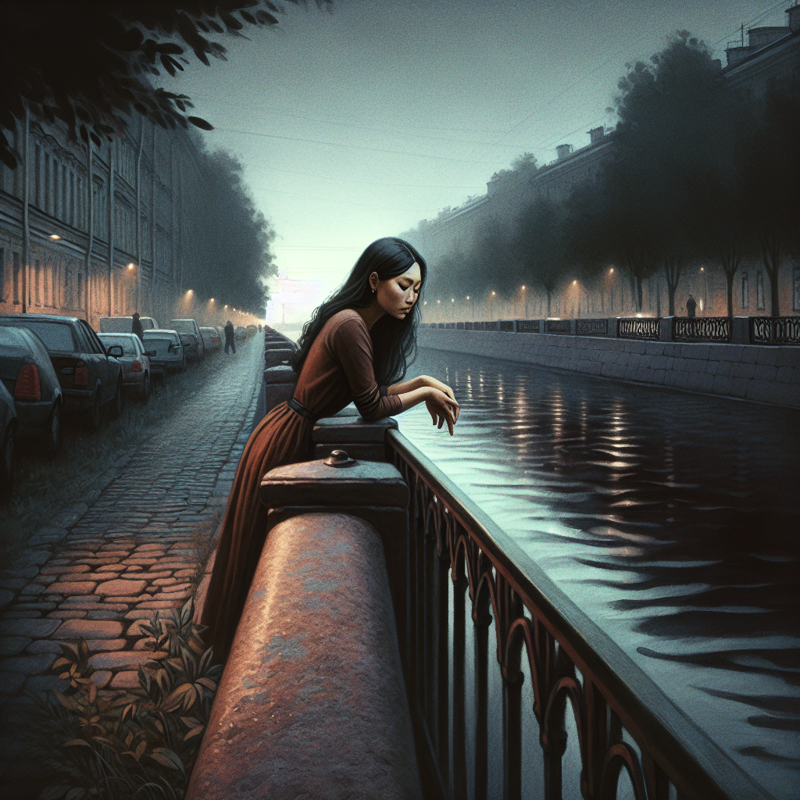

 My way lay along the canal embankment, where at that hour you never meet a soul. It is true that I live in a very remote part of the town. I walked along singing, for when I am happy I am always humming to myself like every happy man who has no friend or acquaintance with whom to share his joy. Suddenly I had a most unexpected adventure.

Leaning on the canal railing stood a woman with her elbows on the rail, she was apparently looking with great attention at the muddy water of the canal.
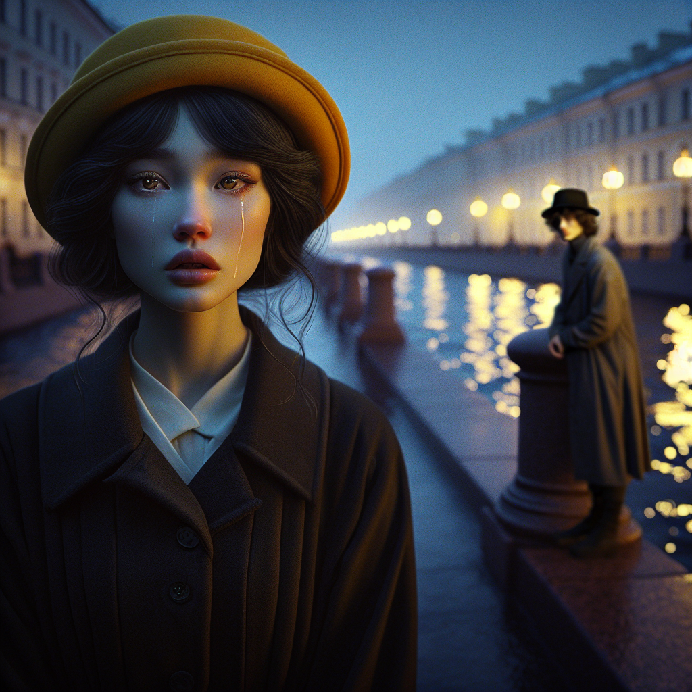

 She was wearing a very charming yellow hat and a jaunty little black mantle. "She's a girl, and I am sure she is dark," I thought. She did not seem to hear my footsteps, and did not even stir when I passed by with bated breath and loudly throbbing heart.

"Strange," I thought; "she must be deeply absorbed in something," and all at once I stopped as though petrified. I heard a muffled sob. Yes! I was not mistaken, the girl was crying, and a minute later I heard sob after sob. Good Heavens! My heart sank. And timid as I was with women, yet this was such a moment!... I turned, took a step towards her, and should certainly have pronounced the word "Madam!" if I had not known that that exclamation has been uttered a thousand times in every Russian society novel. It was only that reflection stopped me. But while I was seeking for a word, the girl came to herself, looked round, started, cast down her eyes and slipped by me along the embankment.

 I at once followed her; but she, divining this, left the embankment, crossed the road and walked along the pavement. I dared not cross the street after her. My heart was fluttering like a captured bird.
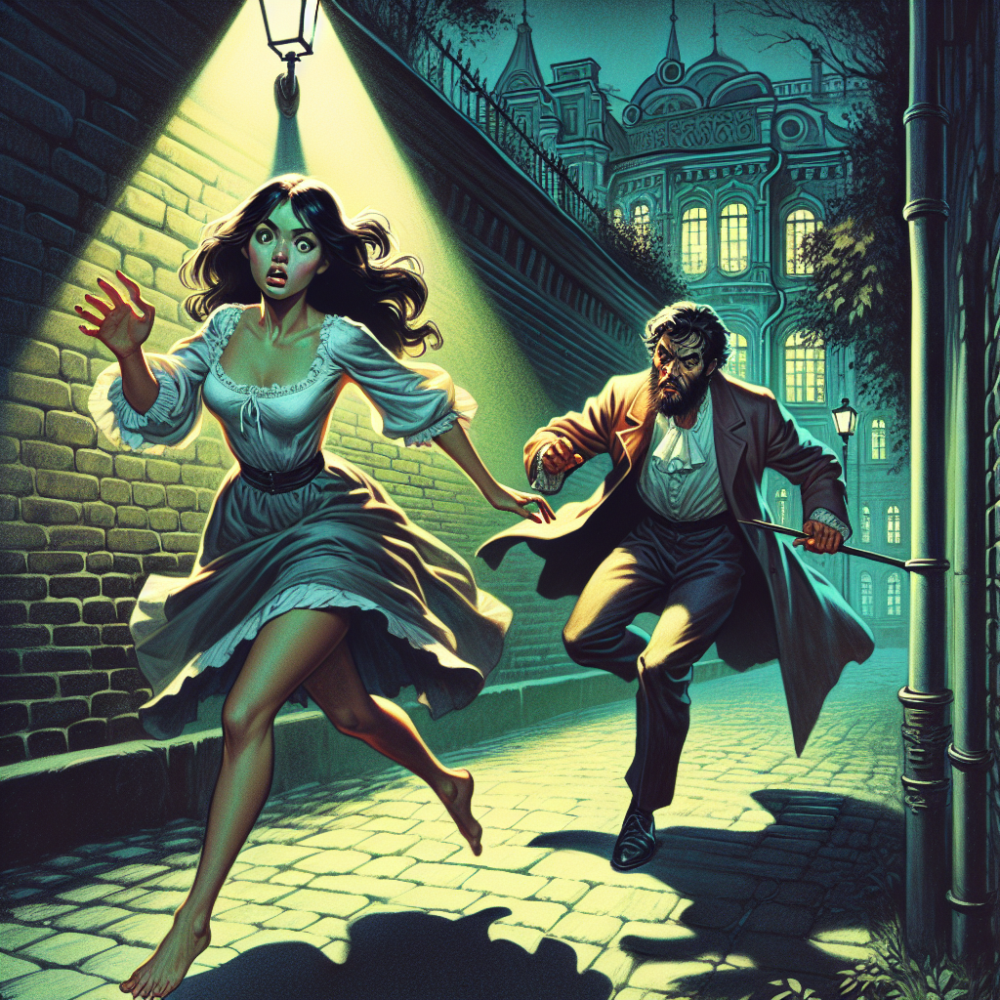

 All at once a chance came to my aid.

Along the same side of the pavement there suddenly came into sight, not far from the girl, a gentleman in evening dress, of dignified years, though by no means of dignified carriage; he was staggering and cautiously leaning against the wall. The girl flew straight as an arrow, with the timid haste one sees in all girls who do not want any one to volunteer to accompany them home at night, and no doubt the staggering gentleman would not have pursued her, if my good luck had not prompted him.

Suddenly, without a word to any one, the gentleman set off and flew full speed in pursuit of my unknown lady. She was racing like the wind, but the staggering gentleman was overtaking—overtook her. The girl uttered a shriek, and ... I bless my luck for the excellent knotted stick, which happened on that occasion to be in my right hand.
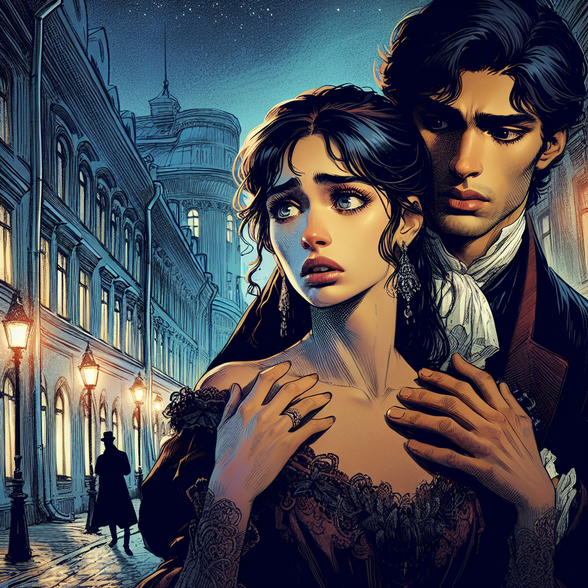

 In a flash I was on the other side of the street; in a flash the obtrusive gentleman had taken in the position, had grasped the irresistible argument, fallen back without a word, and only when we were very far away protested against my action in rather vigorous language. But his words hardly reached us.

"Give me your arm," I said to the girl. "And he won't dare to annoy us further."

She took my arm without a word, still trembling with excitement and terror. Oh, obtrusive gentleman! How I blessed you at that moment! I stole a glance at her, she was very charming and dark—I had guessed right.

On her black eyelashes there still glistened a tear—from her recent terror or her former grief—I don't know. But there was already a gleam of a smile on her lips. She too stole a glance at me, faintly blushed and looked down.

"There, you see; why did you drive me away? If I had been here, nothing would have happened...."

"But I did not know you; I thought that you too...."
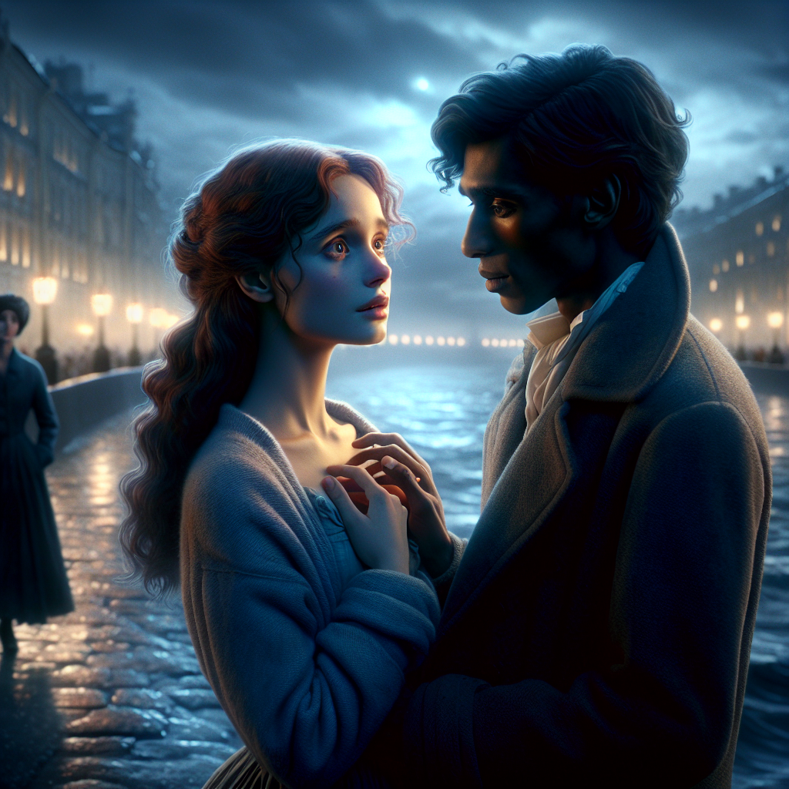

"Why, do you know me now?"

"A little! Here, for instance, why are you trembling?"

"Oh, you are right at the first guess!" I answered, delighted that my girl had intelligence; that is never out of place in company with beauty. "Yes, from the first glance you have guessed the sort of man you have to do with. Precisely; I am shy with women, I am agitated, I don't deny it, as much so as you were a minute ago when that gentleman alarmed you. I am in some alarm now. It's like a dream, and I never guessed even in my sleep that I should ever talk with any woman."

"What? Really?..."

"Yes; if my arm trembles, it is because it has never been held by a pretty little hand like yours. I am a complete stranger to women; that is, I have never been used to them. You see, I am alone.... I don't even know how to talk to them. Here, I don't know now whether I have not said something silly to you! Tell me frankly; I assure you beforehand that I am not quick to take offence?..."

"No, nothing, nothing, quite the contrary. And if you insist on my speaking frankly, I will tell you that women like such timidity; and if you want to know more, I like it too, and I won't drive you away till I get home."

"You will make me," I said, breathless with delight, "lose my timidity, and then farewell to all my chances...."

"Chances! What chances—of what? That's not so nice."

"I beg your pardon, I am sorry, it was a slip of the tongue; but how can you expect one at such a moment to have no desire...."
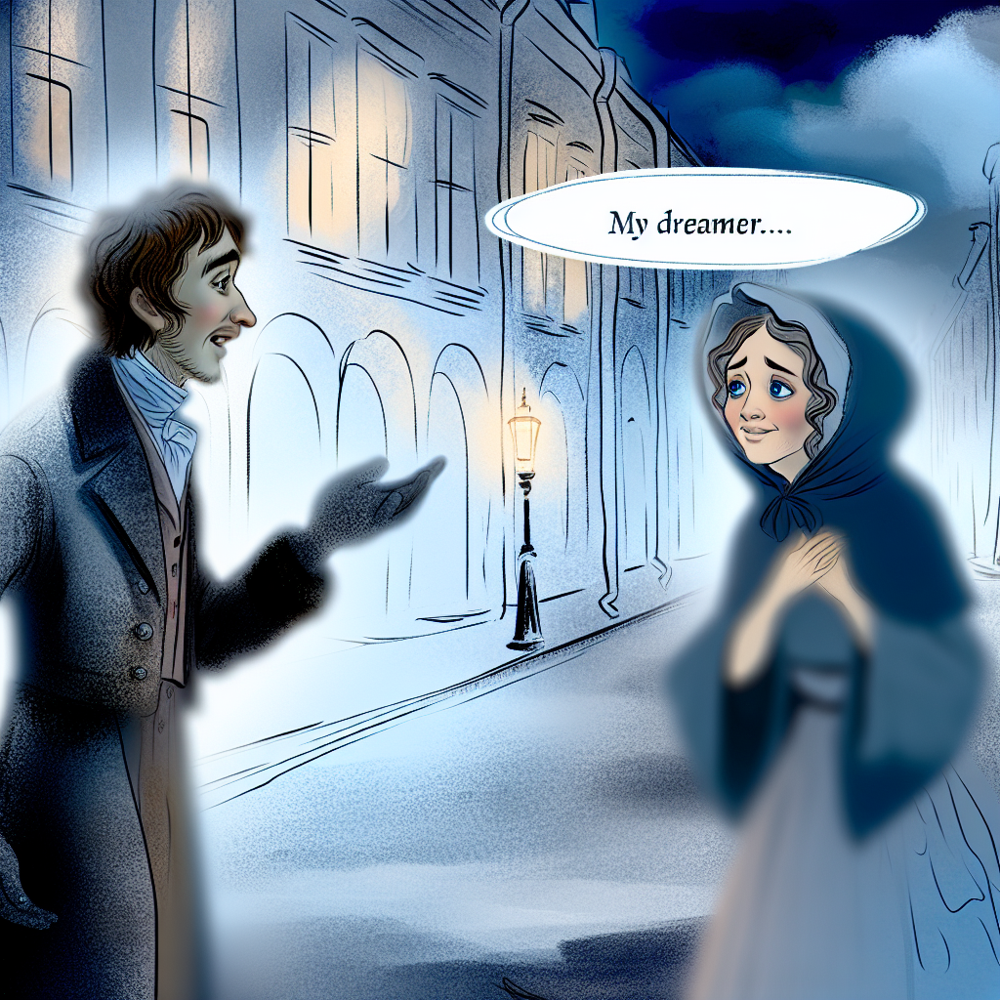

"To be liked, eh?"

"Well, yes; but do, for goodness' sake, be kind. Think what I am! Here, I am twenty-six and I have never seen any one. How can I speak well, tactfully, and to the point? It will seem better to you when I have told you everything openly.... I don't know how to be silent when my heart is speaking. Well, never mind.... Believe me, not one woman, never, never! No acquaintance of any sort! And I do nothing but dream every day that at last I shall meet some one. Oh, if only you knew how often I have been in love in that way...."
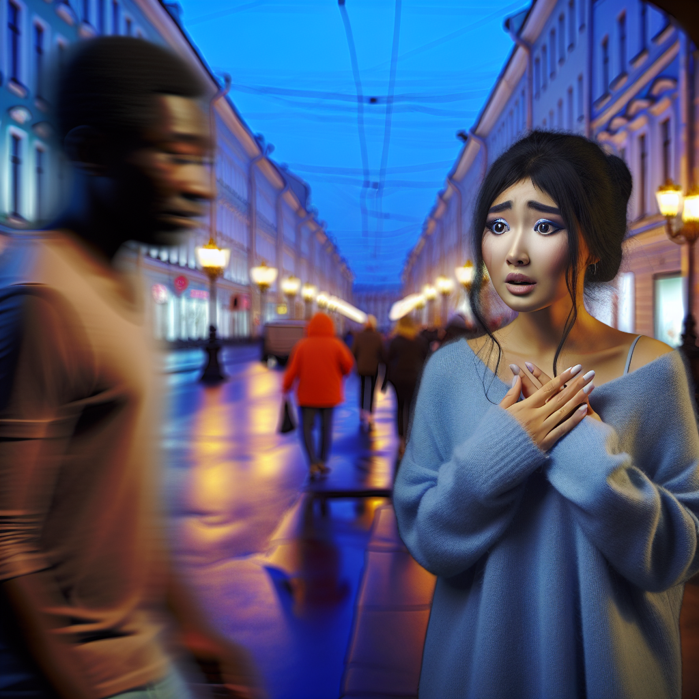

"How? With whom?..."

"Why, with no one, with an ideal, with the one I dream of in my sleep. I make up regular romances in my dreams. Ah, you don't know me! It's true, of course, I have met two or three women, but what sort of women were they? They were all landladies, that.... But I shall make you laugh if I tell you that I have several times thought of speaking, just simply speaking, to some aristocratic lady in the street, when she is alone, I need hardly say; speaking to her, of course, timidly, respectfully, passionately; telling her that I am perishing in solitude, begging her not to send me away; saying that I have no chance of making the acquaintance of any woman; impressing upon her that it is a positive duty for a woman not to repulse so timid a prayer from such a luckless man as me.

 That, in fact, all I ask is, that she should say two or three sisterly words with sympathy, should not repulse me at first sight; should take me on trust and listen to what I say; should laugh at me if she likes, encourage me, say two words to me, only two words, even though we never meet again afterwards!... But you are laughing; however, that is why I am telling you...."

"Don't be vexed; I am only laughing at your being your own enemy, and if you had tried you would have succeeded, perhaps, even though it had been in the street; the simpler the better.... No kind-hearted woman, unless she were stupid or, still more, vexed about something at the moment, could bring herself to send you away without those two words which you ask for so timidly.... But what am I saying? Of course she would take you for a madman. I was judging by myself; I know a good deal about other people's lives."

"Oh, thank you," I cried; "you don't know what you have done for me now!
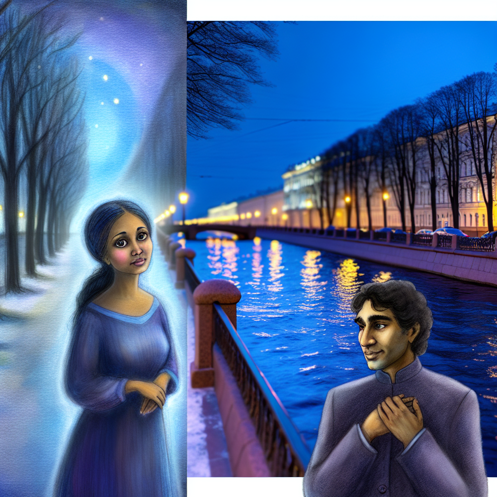

"

"I am glad! I am glad! But tell me how did you find out that I was the sort of woman with whom ... well, whom you think worthy ... of attention and friendship ... in fact, not a landlady as you say? What made you decide to come up to me?"

"What made me?... But you were alone; that gentleman was too insolent; it's night. You must admit that it was a duty...."

"No, no; I mean before, on the other side—you know you meant to come up to me."

"On the other side? Really I don't know how to answer; I am afraid to.... Do you know I have been happy to-day? I walked along singing; I went out into the country; I have never had such happy moments.
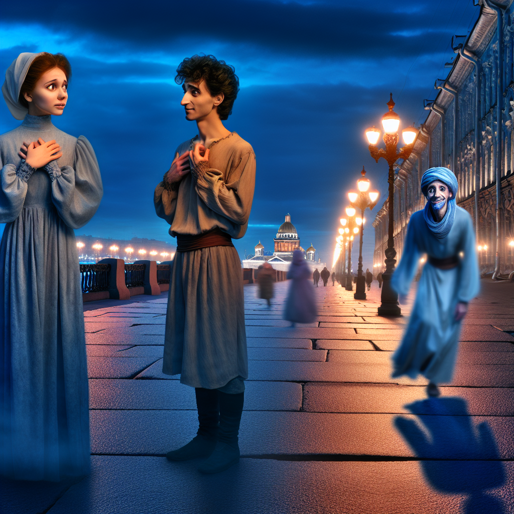

 You ... perhaps it was my fancy.... Forgive me for referring to it; I fancied you were crying, and I ... could not bear to hear it ... it made my heart ache.... Oh, my goodness! Surely I might be troubled about you? Surely there was no harm in feeling brotherly compassion for you.... I beg your pardon, I said compassion.... Well, in short, surely you would not be offended at my involuntary impulse to go up to you?..."

"Stop, that's enough, don't talk of it," said the girl, looking down, and pressing my hand. "It's my fault for having spoken of it; but I am glad I was not mistaken in you.... But here I am home; I must go down this turning, it's two steps from here.... Good-bye, thank you!..."

"Surely ... surely you don't mean ... that we shall never see each other again?... Surely this is not to be the end?"

"You see," said the girl, laughing, "at first you only wanted two words, and now.... However, I won't say anything ... perhaps we shall meet...."

"I shall come here to-morrow,"

 I said. "Oh, forgive me, I am already making demands...."

"Yes, you are not very patient ... you are almost insisting."

"Listen, listen!" I interrupted her. "Forgive me if I tell you something else.... I tell you what, I can't help coming here to-morrow, I am a dreamer; I have so little real life that I look upon such moments as this now, as so rare, that I cannot help going over such moments again in my dreams. I shall be dreaming of you all night, a whole week, a whole year. I shall certainly come here to-morrow, just here to this place, just at the same hour, and I shall be happy remembering to-day. This place is dear to me already. I have already two or three such places in Petersburg. I once shed tears over memories ... like you.... Who knows, perhaps you were weeping ten minutes ago over some memory.... But, forgive me, I have forgotten myself again; perhaps you have once been particularly happy here...."
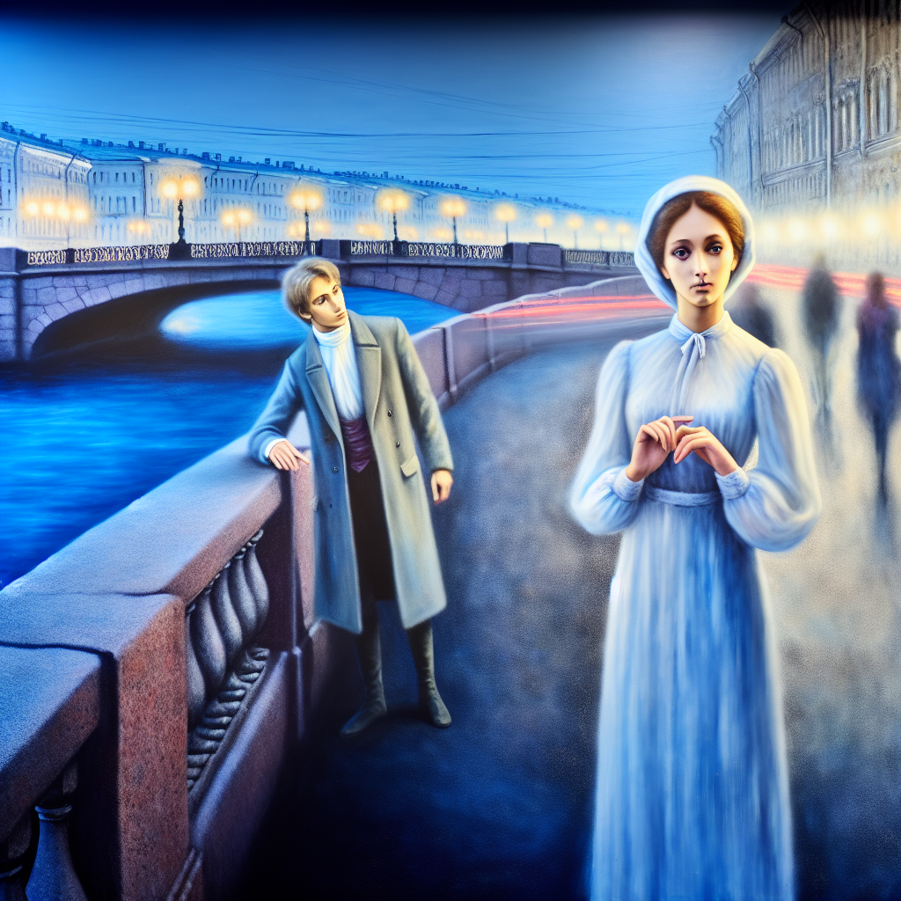

"Very good," said the girl, "perhaps I will come here to-morrow, too, at ten o'clock. I see that I can't forbid you.... The fact is, I have to be here; don't imagine that I am making an appointment with you; I tell you beforehand that I have to be here on my own account. But ... well, I tell you straight out, I don't mind if you do come. To begin with, something unpleasant might happen as it did to-day, but never mind that.... In short, I should simply like to see you ... to say two words to you. Only, mind, you must not think the worse of me now! Don't think I make appointments so lightly.... I shouldn't make it except that.... But let that be my secret! Only a compact beforehand...."

"A compact! Speak, tell me, tell me all beforehand; I agree to anything, I am ready for anything," I cried delighted. "I answer for myself, I will be obedient, respectful ... you know me...."

"It's just because I do know you that I ask you to come to-morrow," said the girl, laughing.

 "I know you perfectly. But mind you will come on the condition, in the first place (only be good, do what I ask—you see, I speak frankly), you won't fall in love with me.... That's impossible, I assure you. I am ready for friendship; here's my hand.... But you mustn't fall in love with me, I beg you!"

"I swear," I cried, gripping her hand....

"Hush, don't swear, I know you are ready to flare up like gunpowder. Don't think ill of me for saying so. If only you knew.... I, too, have no one to whom I can say a word, whose advice I can ask. Of course, one does not look for an adviser in the street; but you are an exception. I know you as though we had been friends for twenty years.... You won't deceive me, will you?..."

"You will see ... the only thing is, I don't know how I am going to survive the next twenty-four hours.

"

"Sleep soundly. Good-night, and remember that I have trusted you already. But you exclaimed so nicely just now, 'Surely one can't be held responsible for every feeling, even for brotherly sympathy!' Do you know, that was so nicely said, that the idea struck me at once, that I might confide in you?"

"For God's sake do; but about what? What is it?"

"Wait till to-morrow. Meanwhile, let that be a secret. So much the better for you; it will give it a faint flavour of romance. Perhaps I will tell you to-morrow, and perhaps not.... I will talk to you a little more beforehand; we will get to know each other better...."

"Oh yes, I will tell you all about myself to-morrow! But what has happened? It is as though a miracle had befallen me.... My God, where am I? Come, tell me aren't you glad that you were not angry and did not drive me away at the first moment, as any other woman would have done?

 In two minutes you have made me happy for ever. Yes, happy; who knows, perhaps, you have reconciled me with myself, solved my doubts!... Perhaps such moments come upon me.... But there I will tell you all about it to-morrow, you shall know everything, everything.

..."

"Very well, I consent; you shall begin...."

"Agreed."

"Good-bye till to-morrow!"

"Till to-morrow!"

And we parted. I walked about all night; I could not make up my mind to go home. I was so happy.... To-morrow!

SECOND NIGHT

"Well, so you have survived!" she said, pressing both my hands.

"I've been here for the last two hours; you don't know what a state I have been in all day."

"I know, I know. But to business. Do you know why I have come? Not to talk nonsense, as I did yesterday. I tell you what, we must behave more sensibly in future. I thought a great deal about it last night."

"In what way—in what must we be more sensible? I am ready for my part; but, really, nothing more sensible has happened to me in my life than this, now."

"Really? In the first place, I beg you not to squeeze my hands so; secondly, I must tell you that I spent a long time thinking about you and feeling doubtful to-day.

"

"And how did it end?"

"How did it end? The upshot of it is that we must begin all over again, because the conclusion I reached to-day was that I don't know you at all; that I behaved like a baby last night, like a little girl; and, of course, the fact of it is, that it's my soft heart that is to blame—that is, I sang my own praises, as one always does in the end when one analyses one's conduct. And therefore to correct my mistake, I've made up my mind to find out all about you minutely.

 But as I have no one from whom I can find out anything, you must tell me everything fully yourself. Well, what sort of man are you? Come, make haste—begin—tell me your whole history.

"

"My history!" I cried in alarm. "My history! But who has told you I have a history? I have no history...."

"Then how have you lived, if you have no history?" she interrupted, laughing.

"Absolutely without any history! I have lived, as they say, keeping myself to myself, that is, utterly alone—alone, entirely alone. Do you know what it means to be alone?"

"But how alone? Do you mean you never saw any one?"

"Oh no, I see people, of course; but still I am alone."

"Why, do you never talk to any one?"

"Strictly speaking, with no one."

"Who are you then? Explain yourself!

 Stay, I guess: most likely, like me you have a grandmother. She is blind and will never let me go anywhere, so that I have almost forgotten how to talk; and when I played some pranks two years ago, and she saw there was no holding me in, she called me up and pinned my dress to hers, and ever since we sit like that for days together; she knits a stocking, though she's blind, and I sit beside her, sew or read aloud to her—it's such a queer habit, here for two years I've been pinned to her...."

"Good Heavens! what misery! But no, I haven't a grandmother like that."

"Well, if you haven't why do you sit at home?..."

"Listen, do you want to know the sort of man I am?"

"Yes, yes!"

"In the strict sense of the word?"

"In the very strictest sense of the word."

"Very well, I am a type!"

"Type, type! What sort of type?" cried the girl, laughing, as though she had not had a chance of laughing for a whole year. "Yes, it's very amusing talking to you. Look, here's a seat, let us sit down. No one is passing here, no one will hear us, and—begin your history. For it's no good your telling me, I know you have a history; only you are concealing it. To begin with, what is a type?"

"A type? A type is an original, it's an absurd person!" I said, infected by her childish laughter. "It's a character. Listen; do you know what is meant by a dreamer?"

"A dreamer! Indeed I should think I do know. I am a dreamer myself. Sometimes, as I sit by grandmother, all sorts of things come into my head. Why, when one begins dreaming one lets one's fancy run away with one—why, I marry a Chinese Prince!... Though sometimes it is a good thing to dream! But, goodness knows! Especially when one has something to think of apart from dreams," added the girl, this time rather seriously.

"Excellent! If you have been married to a Chinese Emperor, you will quite understand me. Come, listen.... But one minute, I don't know your name yet."

"At last! You have been in no hurry to think of it!

"

"Oh, my goodness! It never entered my head, I felt quite happy as it was...."

"My name is Nastenka."

"Nastenka! And nothing else?"

"Nothing else! Why, is not that enough for you, you insatiable person?